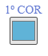
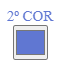
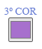
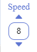
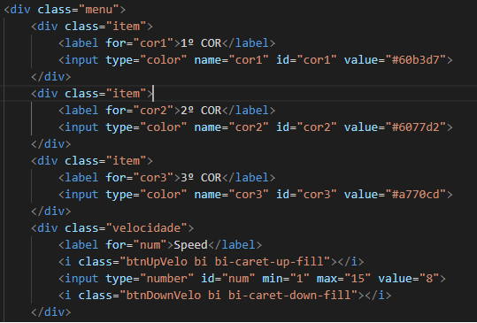
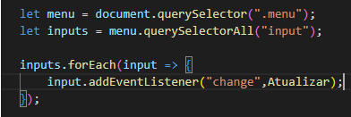

# Background Gradient Animation

> ## **url test:** [https://stefanluks.github.io/Background-Gradient-Animation/](https://stefanluks.github.io/Background-Gradient-Animation/)

 

### This project is a simple javascript application that controls and manipulates a gradient in the background.   The system has three color options, when changed the value of the inputs is automatically changed in the background.   System also has two other functions, speed and direction.

 

 
First the inputs html elements receive an event, triggering the _Atulizar()_ function whenever its value changes:
 

 

 

> ## Function Atualizar()   

